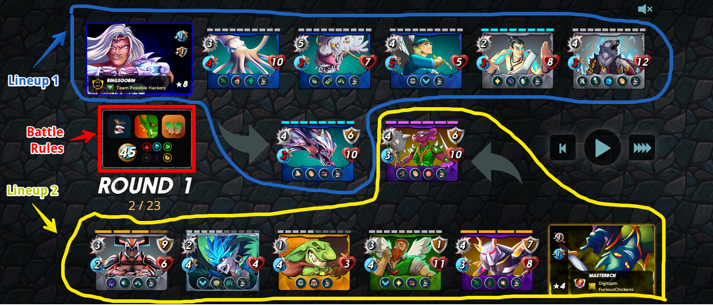

# splinterlandsBotV1

## Intro
Spinterlands is an online pvp card game where players play 1v1 battles against each other. 

The battle resolves automatically, so the aim of the game is to select the better lineup than your opponent.

Challenge is that each battle varies a lot based on battle rules that are randomly determined before lineup selection starts.

Battle rules are:
* mana cap: Max mana that your lineup can cost this battle. Each card costs mana to play, better cards cost more mana.
* inactive: Elements that are unavailable in this battle. Each card belongs to a certain element, if the element is inactive, that card can't be used in this battle.
* ruleset: Additional rules for the battle. Can be restrictive (like ranged monters cant be used), rule bending (like all mosters lose armor), etc.

Battle example:

Aim is to create a ML/AI model that will predict lineups based on the battle rules. 
 
Since GPT2 model generates output based on previous data, assumption is that same model structure here might produce good results.

## Input

Input of the model is battle rules:
* mana is an int
* inactive and ruleset are each converted using one hot encoding
* id of cards selected for the lineup so far

## Processing the input

Input data is used to train a GPTlike model to generate the next card for the lineup. Code is in spl_bot_model_training.ipynb. Trained model is spl_bot_model.pt.

## Output

Model inference can be tested using streamlit app in spl_bot_inference_streamlit.py

## Model Evaluation

Unfortunately model doesn't work very good, it often returns most frequent lineups, regardless of the rules.
Next steps are to try and make the model pay more attention to the rules.

